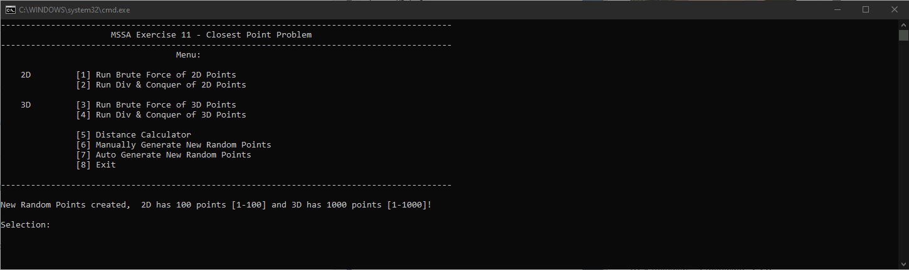

# ClosestPoints

## Microsoft Software & Systems Academy Exercise 11

### Requirements:
- Write a console application 
- Create a data structure to hold 100 random integers to represent (x,y) cartesian coordinates ranging from 1-100
- Find the nearest distance between these random points
- Create a data structure to hold 1000 random integers to represent (x,y,Z) cartesian coordinates ranging from 1-1000
- Find the nearest distance between these random points

### Solution Brute Force Apporoach
- Create Point Class to store x,y or z
- Create n number of Point instances with random x,y or z values within required ranges
- Store Points in a HashSet for to create unique points only 
> **NOTE: Number of points and range should be considered if increasing values. Max combination of points is 2^n, where n=number of points.  It may take some time for Random class to generate unique pairs.  If unique is not a concern. Switch out HashSet for another data stucture to store poins**
- Iterate through each point and calculate the distance with each other point using Euclidean distance formual.

### Solution Divide & Conquer Approach
 I implemented this using the following reference https://sites.cs.ucsb.edu/~suri/cs235/ClosestPair.pdf
